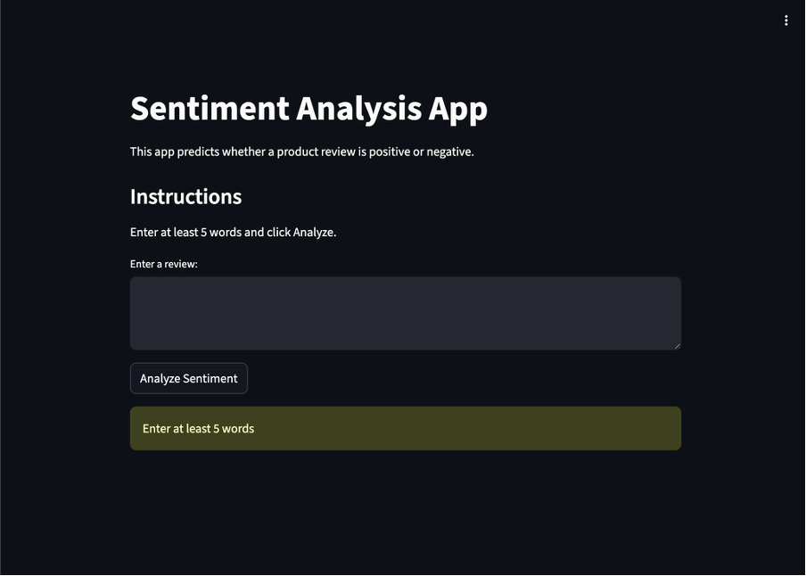
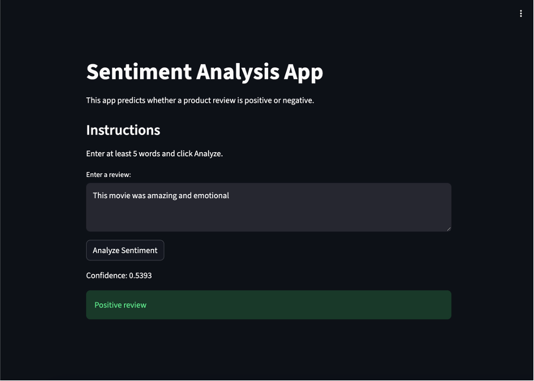
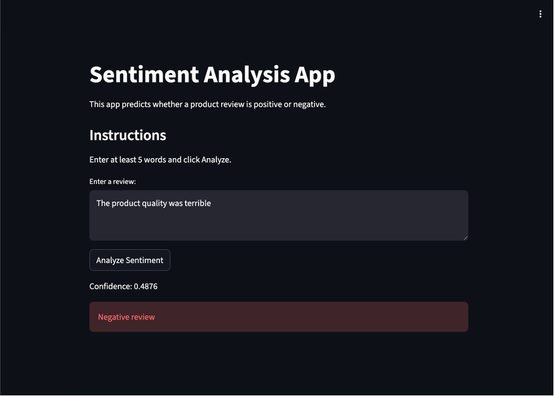

# AI Sentiment Analysis Web App

## Project Overview
This project is a machine learning based sentiment analysis web application designed to classify product or movie reviews as positive or negative. The system uses Natural Language Processing (NLP) and a Deep Neural Network (DNN) model built with TensorFlow and deployed through a simple web interface.

## Business Problem
Businesses receive large volumes of customer reviews and feedback across online platforms. Manually analysing customer sentiment is time consuming and inconsistent. This project demonstrates how AI can assist organisations in automatically identifying customer opinions and improving decision making through sentiment classification.

## Proposed Solution
The proposed solution uses a trained sentiment analysis model to process text reviews and predict whether the sentiment is positive or negative. The application provides a simple interface where users can enter a review and instantly receive a prediction result with confidence score.

## Key Features
- AI based sentiment classification
- Positive and negative review prediction
- Confidence score display
- TensorFlow deep learning model
- NLP text preprocessing
- Interactive web application
- Real time prediction result
- Simple and user friendly interface

## Machine Learning Model
The sentiment analysis model was developed using TensorFlow and Keras with a Deep Neural Network architecture.

### Model Architecture
```python
model = tf.keras.Sequential([
    tf.keras.layers.Input(shape=(MAX_WORDS,)),
    tf.keras.layers.Dense(128, activation="relu"),
    tf.keras.layers.Dropout(0.4),
    tf.keras.layers.Dense(64, activation="relu"),
    tf.keras.layers.Dropout(0.3),
    tf.keras.layers.Dense(1, activation="sigmoid")
])

model.compile(
    loss="binary_crossentropy",
    optimizer="adam",
    metrics=["accuracy"]
)
```

---

## My Role
I developed the sentiment analysis workflow including data preprocessing, model training, evaluation and deployment preparation. I also designed the web interface and managed the integration between the trained AI model and prediction application.

---

## Tools and Technologies Used
- Python
- TensorFlow
- Keras
- NLP
- Streamlit
- Google Colab
- GitHub
- Machine Learning
- Deep Learning

---

## Skills Demonstrated
- Machine learning model development
- Natural Language Processing
- Deep learning implementation
- Data preprocessing
- Model evaluation
- AI application deployment
- Python programming
- Analytical problem solving

---

## Ethical Considerations
The project considered ethical concerns related to AI bias and dataset quality. Text preprocessing and balanced data preparation were used to reduce misleading sentiment predictions and improve fairness in classification results.

---

## Screenshots

### Main Application Interface


### Positive Prediction Example


### Negative Prediction Example


---

## Repository Structure

```text
AI-Sentiment-Analysis-Web-App
│
├── artifacts
├── model
├── notebooks
├── screenshots
│
├── .gitignore
├── LICENSE
├── README.md
```

---

## Project Outcome
This project demonstrates how Artificial Intelligence and Natural Language Processing can be applied to automate sentiment analysis and support data driven decision making through an accessible web application.
